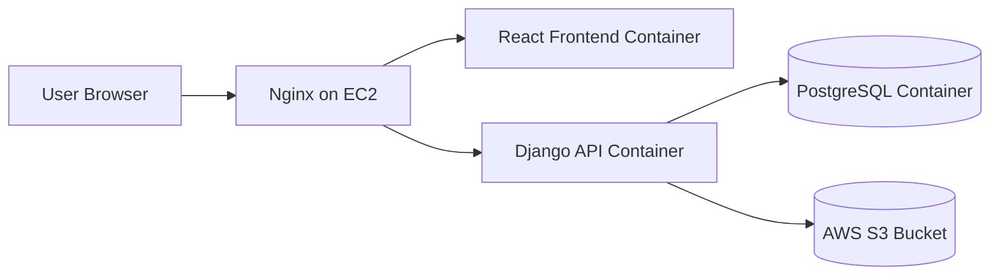

# Task CRUD App - Django + React + PostgreSQL + Docker + AWS

A small full stack CRUD application built to demonstrate:

- database connectivity
- REST API routing
- Docker containerization
- Nginx reverse proxy
- production deployment on AWS Free Tier
- secure environment variable handling
- S3 file upload integration

---

## 1. Architecture design

### Stack

- **Backend:** Django + Django REST Framework
- **Frontend:** React + Vite
- **Database:** PostgreSQL
- **Reverse proxy:** Nginx
- **Storage:** AWS S3 for uploaded files in production
- **Hosting:** AWS EC2 (Free Tier eligible instance such as `t2.micro` or `t3.micro`)

### High-level flow

1. User opens the application through Nginx.
2. Nginx routes `/` to the React frontend.
3. Nginx routes `/api/` and `/media/` to Django.
4. Django reads and writes Task data to PostgreSQL.
5. File uploads are stored locally in development and on S3 in production.

### Simple infrastructure diagram



### Containers

- `postgres` - database container
- `backend` - Django REST API
- `frontend` - React app for development / app runtime in local compose
- `nginx` - reverse proxy and public entry point

### Backend endpoints

- `GET /api/tasks/` - list tasks
- `POST /api/tasks/` - create task
- `GET /api/tasks/<id>/` - task details
- `PUT /api/tasks/<id>/` - update task
- `DELETE /api/tasks/<id>/` - delete task
- `POST /api/tasks/upload-only/` - simple upload endpoint
- `GET /health/` - health check

---

## 2. Project structure

```text
crud_app_project/
├── backend/
├── frontend/
├── nginx/
├── docs/
├── docker-compose.yml
├── docker-compose.prod.yml
├── .env.example
├── .gitignore
└── README.md
```

---

## 3. Local development steps

### Prerequisites

- Docker
- Docker Compose plugin

### Setup

```bash
cp .env.example .env
```

Update `.env` values as needed.

### Run locally

```bash
docker compose up --build
```

### Open the application

- Frontend: `http://localhost`
- API list: `http://localhost/api/tasks/`
- Health check: `http://localhost/health/`

### Stop containers

```bash
docker compose down
```

---

## 4. Production deployment steps on AWS EC2

### Step 1 - Create AWS resources

Create:

- 1 EC2 instance
- 1 S3 bucket
- 1 IAM user or IAM role with least privilege for S3 access
- 1 Elastic IP (recommended)

### Step 2 - Launch EC2

AWS free-tier setup:

- Ubuntu 22.04 LTS
- instance type: `t3.micro`
- security group allowing only ports 80, 443 publicly, and port 22 from your IP only

### Step 3 - Install Docker on EC2

```bash
sudo apt update
sudo apt install -y ca-certificates curl gnupg
sudo install -m 0755 -d /etc/apt/keyrings
curl -fsSL https://download.docker.com/linux/ubuntu/gpg | sudo gpg --dearmor -o /etc/apt/keyrings/docker.gpg
sudo chmod a+r /etc/apt/keyrings/docker.gpg

echo \
  "deb [arch=$(dpkg --print-architecture) signed-by=/etc/apt/keyrings/docker.gpg] https://download.docker.com/linux/ubuntu \
  $(. /etc/os-release && echo \"$VERSION_CODENAME\") stable" | \
  sudo tee /etc/apt/sources.list.d/docker.list > /dev/null

sudo apt update
sudo apt install -y docker-ce docker-ce-cli containerd.io docker-buildx-plugin docker-compose-plugin
sudo usermod -aG docker $USER
newgrp docker
```

### Step 4 - Copy project to EC2

```bash
scp -i your-key.pem -r crud_app_project ubuntu@YOUR_EC2_PUBLIC_IP:/home/ubuntu/ or add withing the github
```

### Step 5 - Create production environment file

```bash
cd /home/ubuntu/crud_app_project
cp .env.example .env
nano .env
```

Set real values for:

- Django secret key
- PostgreSQL password
- allowed hosts
- CORS allowed origins
- S3 bucket name
- IAM access key / secret or use EC2 role

### Step 7 - Start production containers

```bash
docker compose -f docker-compose.prod.yml up --build -d
```

## 5. IAM configuration

### Recommended option

Use an **EC2 IAM role** instead of hardcoding AWS credentials.

### Least privilege principle

Grant only the permissions needed for the `media/` folder in the S3 bucket.

A sample policy is included here:

- `docs/iam-policy-s3.json`

### Recommended policy scope

Allow only:

- `s3:PutObject`
- `s3:GetObject`
- `s3:DeleteObject`
- `s3:ListBucket` restricted to the `media/` prefix

### Best practice

- Prefer **instance role** over access keys
- Do not commit secrets to Git
- Keep `.env` only on the server
- Rotate access keys if they are ever exposed

---

## 6. Security group rules

### EC2 security group

Inbound:

- TCP 80 from `0.0.0.0/0`
- TCP 443 from `0.0.0.0/0`
- TCP 22 from **your own public IP only**

Outbound:

- allow outbound traffic as needed for package install, Docker pulls, and S3 access

### Important rule

- **Do not expose PostgreSQL port 5432 publicly**
- PostgreSQL should only be reachable inside Docker's internal network

A short reference file is included:

- `docs/security-groups.md`

---

## 7. AWS Free Tier setup notes

### Free Tier friendly services

- EC2 micro instance
- S3 small storage usage
- IAM role or IAM user
- Route53 optional, not required if using only public IP

### Keep cost low

- Use one micro instance only
- PostgreSQL runs in Docker on EC2
- Keep S3 storage minimal
- Delete unused Elastic IPs and snapshots

---

## 8. Environment variable management

### Root `.env`

Used by Docker Compose to inject variables into containers.

### Backend env values

Important variables:

- `DJANGO_SECRET_KEY`
- `DJANGO_SETTINGS_MODULE`
- `POSTGRES_DB`
- `POSTGRES_USER`
- `POSTGRES_PASSWORD`
- `POSTGRES_HOST`
- `POSTGRES_PORT`
- `CORS_ALLOWED_ORIGINS`
- `CSRF_TRUSTED_ORIGINS`
- `AWS_ACCESS_KEY_ID`
- `AWS_SECRET_ACCESS_KEY`
- `AWS_STORAGE_BUCKET_NAME`
- `AWS_S3_REGION_NAME`
- `USE_S3`

### Development vs production separation

- `config.settings.dev` for local development
- `config.settings.prod` for production hardening

Production adds:

- secure cookies
- SSL redirect
- HSTS
- hardened headers

---

## 9. CORS configuration

CORS is controlled through:

- `CORS_ALLOWED_ORIGINS`

Example:

```env
CORS_ALLOWED_ORIGINS=http://localhost:3000
```

---

## 10. Nginx reverse proxy design

Nginx is the only service exposed publicly.

### Public ports

- 80
- 443

### Internal ports only

- Django 8000
- React 3000
- PostgreSQL 5432

This matches the requirement that only 80 and 443 should be public.

---

## 11. Notes about file uploads and S3

### Development

Uploads are stored in:

- `/app/media`

### Production

When `USE_S3=True`, Django stores files in S3 using `django-storages` and `boto3`.

## 12. Useful commands

### Rebuild containers

```bash
docker compose up --build
```

### Production rebuild

```bash
docker compose -f docker-compose.prod.yml up --build -d
```

### Run Django migrations manually

```bash
docker compose exec backend python manage.py migrate
```

### Create Django superuser

```bash
docker compose exec backend python manage.py createsuperuser
```

### View logs

```bash
docker compose logs -f
```

---

## 13. Security checklist

- No secrets hardcoded in source code
- Environment variables used for DB and AWS config
- PostgreSQL not exposed publicly
- Nginx exposes only 80 and 443
- Least privilege IAM policy documented
- HTTPS documented with Let's Encrypt
- CORS configurable via environment variables
- Separate development and production settings included

---

## 14. Future improvements

This project is intentionally minimal. A real production version could add:

- authentication and authorization
- CI/CD pipeline
- automated SSL renewal strategy
- container registry deployment
- health monitoring and alerting
- backup strategy for PostgreSQL and S3

---
